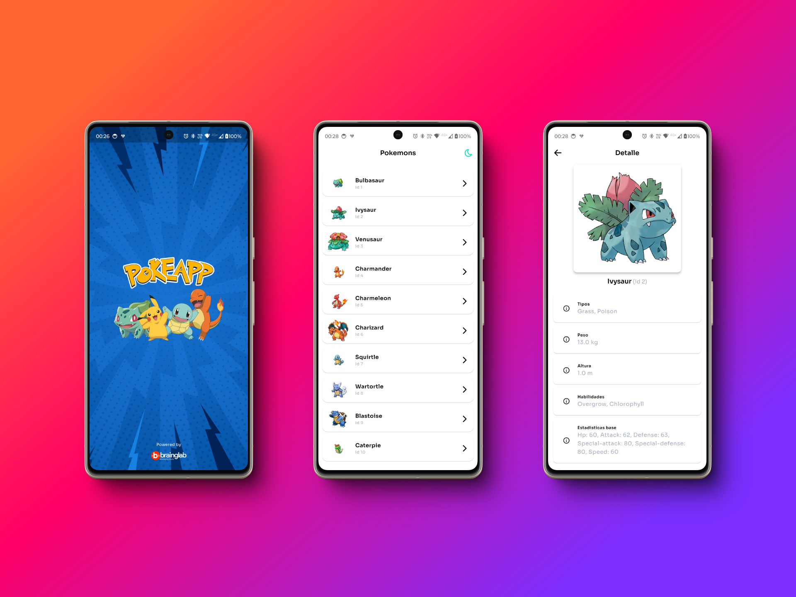
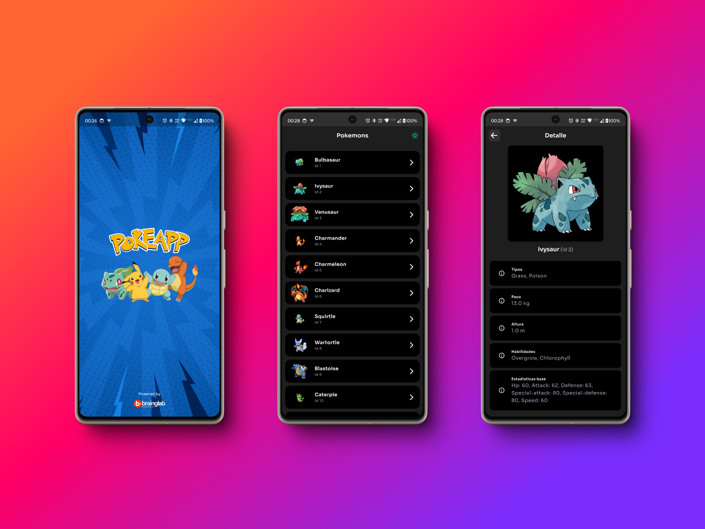

# PokeApp

PokeApp es una aplicación Flutter que permite a los usuarios buscar información sobre Pokémon. Utiliza la PokeAPI para obtener datos y mostrar información detallada de los Pokémon.

## Capturas de pantalla

A continuación, se muestran capturas de pantalla de la aplicación en temas claro y oscuro:

### Tema Claro

### Tema Oscuro

Estas imágenes muestran la interfaz de usuario de la aplicación en ambos modos, destacando la adaptabilidad del diseño a diferentes preferencias de tema.

## Diseño responsivo

La aplicación PokeApp ha sido diseñada con un enfoque en la responsividad, asegurando una experiencia de usuario óptima en una variedad de dispositivos. Algunas características clave del diseño responsivo incluyen:

### Centrado y ancho máximo

- El contenido principal de la aplicación está centrado en la pantalla.
- Se utiliza un ancho máximo de 1024 píxeles para garantizar una legibilidad óptima en pantallas más grandes.

## Versiones de tecnologías usadas

- Versión de Flutter: 3.24.3
- Versión de Dart: 2.17.5

## Características principales

- Buscar Pokémon por nombre o ID
- Ver información detallada de cada Pokémon
- Explorar movimientos y habilidades de los Pokémon
- Caché de imágenes para mejorar el rendimiento
- Soporte para temas claro y oscuro

## Tecnologías y bibliotecas principales

- Flutter
- Dart
- PokeAPI
- Riverpod para gestión de estado
- Dio para peticiones HTTP

## Clases principales

- `PokemonDataSource`: Interfaz abstracta que define los métodos para obtener datos de Pokémon.
- `PokemonDataSourceImpl`: Implementación concreta de `PokemonDataSource` que realiza las peticiones a la API.
- `PokemonModel`: Modelo de datos que representa un Pokémon.
- `BLNetworkImage`: Widget personalizado para cargar y mostrar imágenes de red con caché.
- `DetailPage`: Página que muestra información detallada de un Pokémon específico.
- `CustomButton`: Widget de botón personalizado que se adapta al tema de la aplicación.

## Providers

- `mPokemonByIdProvider`: Proporciona datos de un Pokémon específico por su ID.
- `mCachedPokemonImageProvider`: Gestiona la carga y caché de imágenes de Pokémon.
- `mIsDarkThemeProvider`: Controla el tema actual de la aplicación (claro u oscuro).

Esta aplicación demuestra el uso de arquitectura limpia, patrones de diseño modernos en Flutter y técnicas de optimización como caché de imágenes y gestión eficiente del estado.
